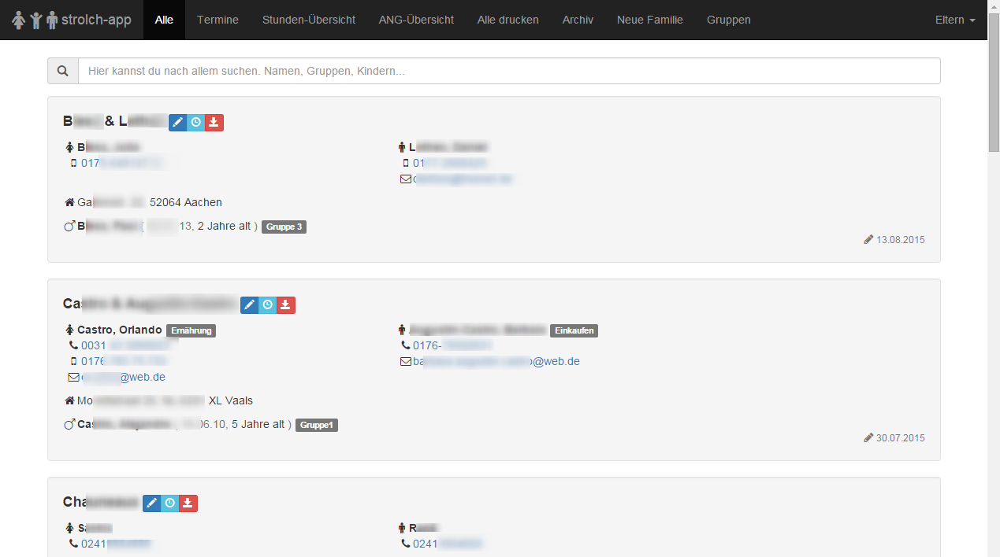
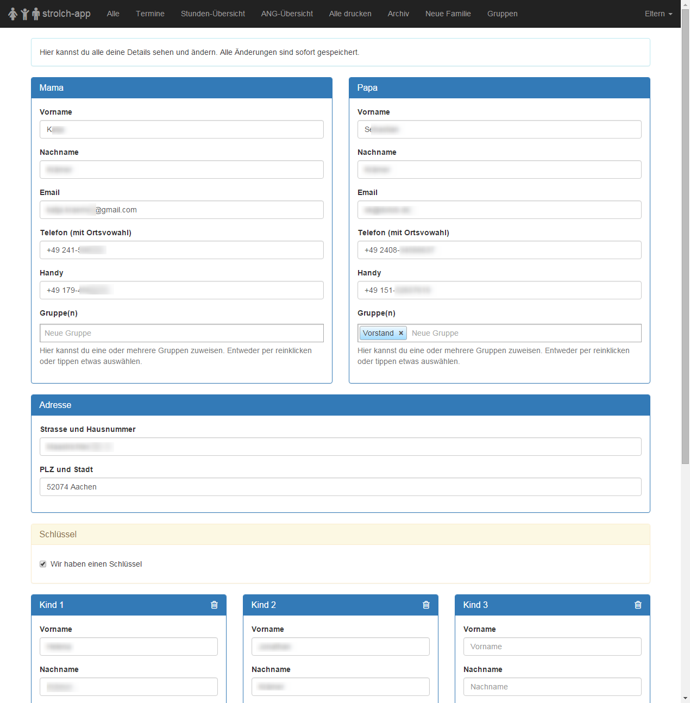
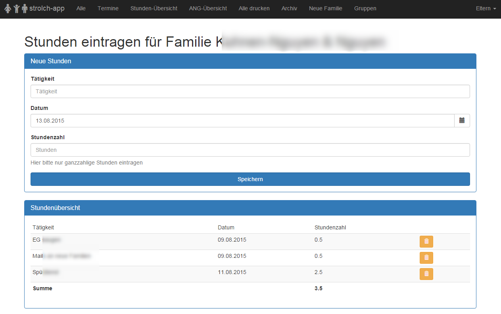
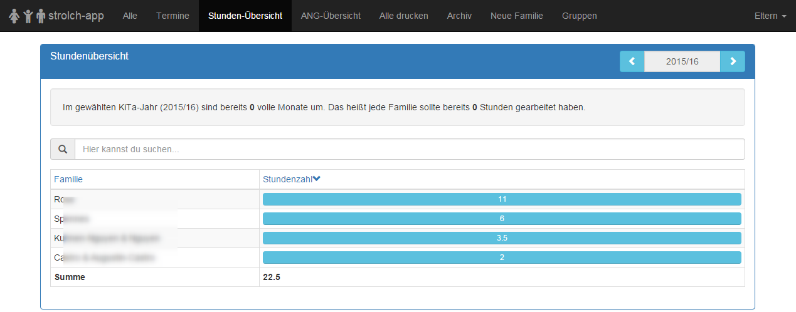
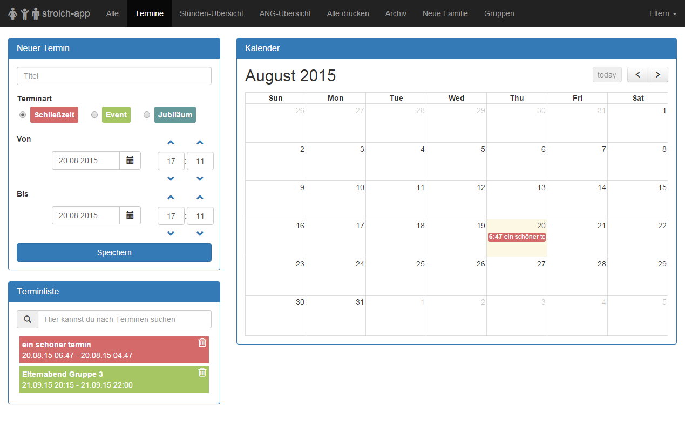
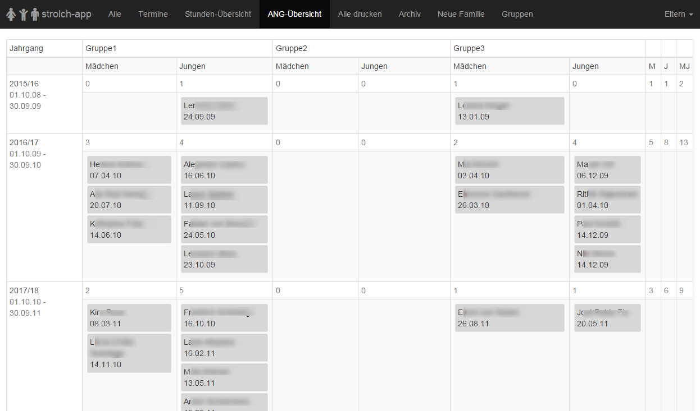
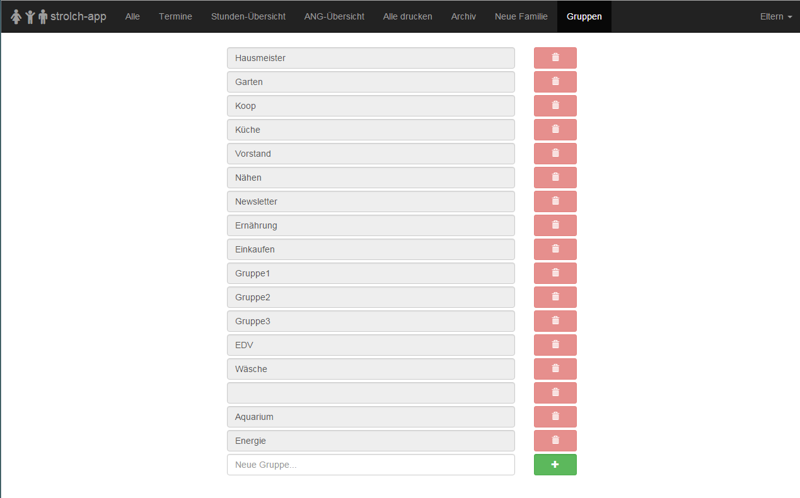

# strolch-app die einfache KiTa-Verwaltung

Die strolch-app bietet Eltern die Möglichkeit ihre Daten selber zu pflegen und allen anderen Eltern zur Verfügung zu stellen. 

# Features

- Eltern Kontaktdaten (Email, Telefon, Adresse)
- Kinder Geburtstage und Alter
- Notfall Kontakte
- Schlüsselbesitz
- Allergiehinweis
- Gruppenzuweisung
- Stundenermittlung
- Kinder-Gruppen-Jahrgangs-Übersicht
- Termin-Übersicht

# screenshots

# Future/TODO
- Planungsgruppen für ANG
- ang date fix
- ang link to edit

